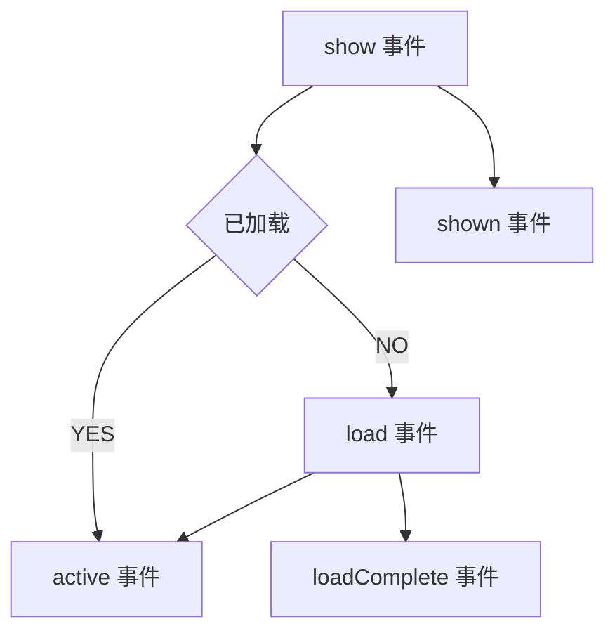

# 页面事件

## 页面的创建

```mermaid
graph TD
    show_event[show 事件] --> is_load{已加载}
    show_event --> shown_event[shown 事件]
    is_load --> |YES|active_event[active 事件]
    is_load --> |NO|load_event[load 事件]
    load_event --> active_event
    load_event --> loadComplete_event[loadComplete 事件]
```

